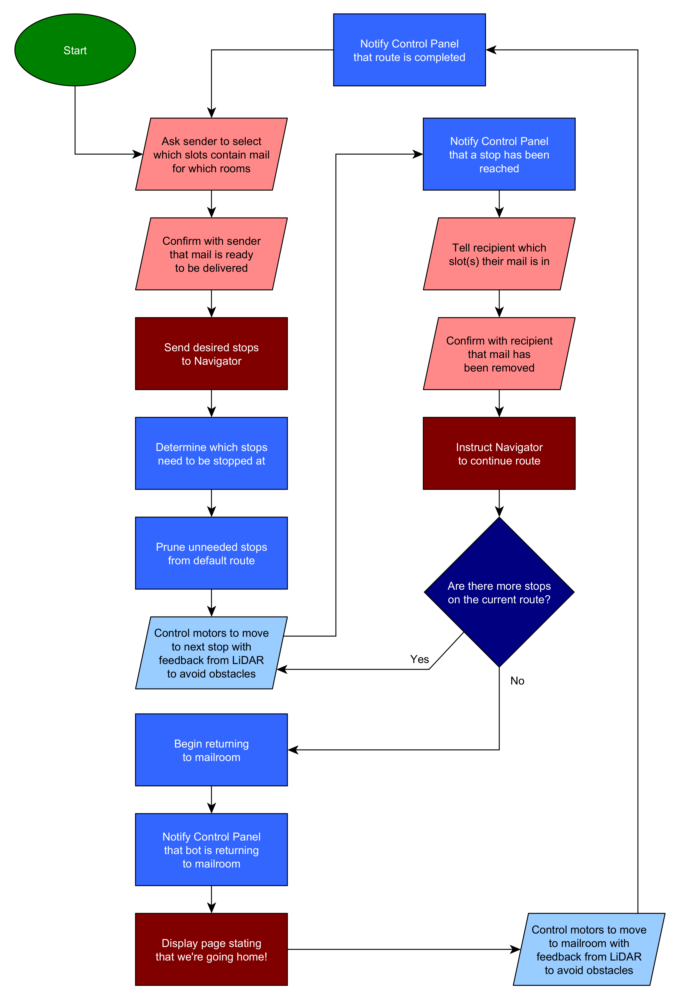
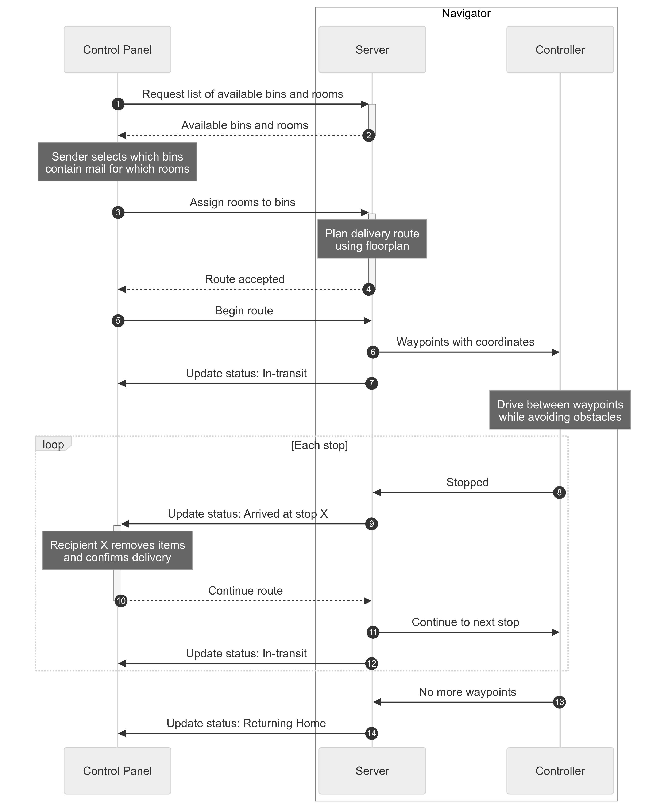
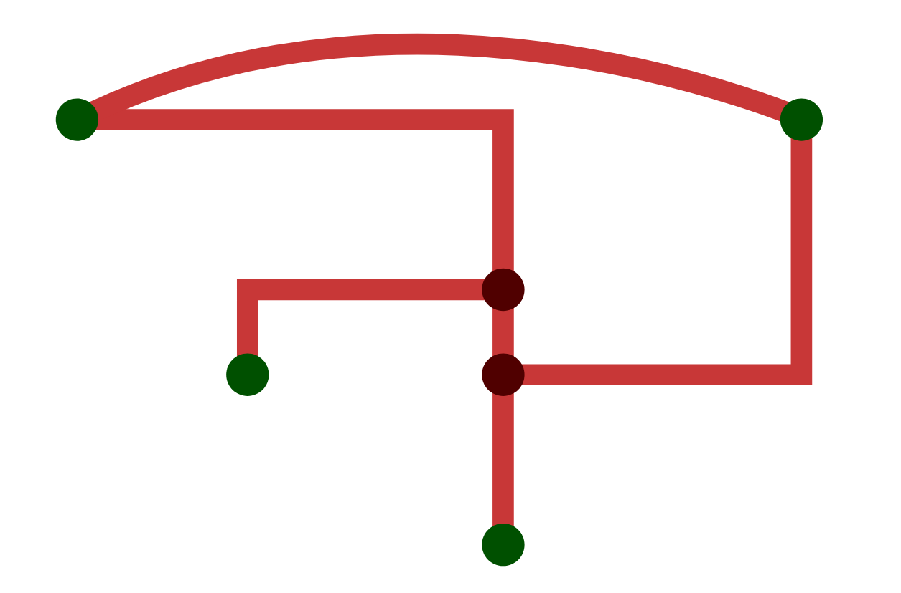
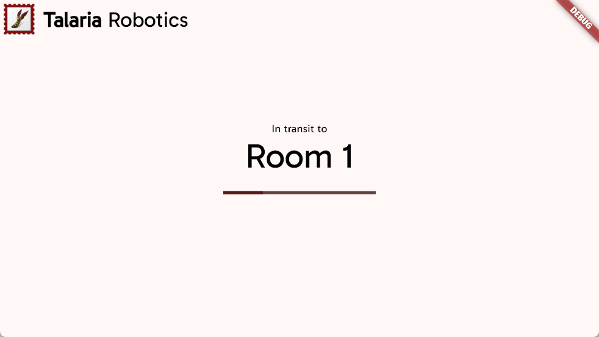
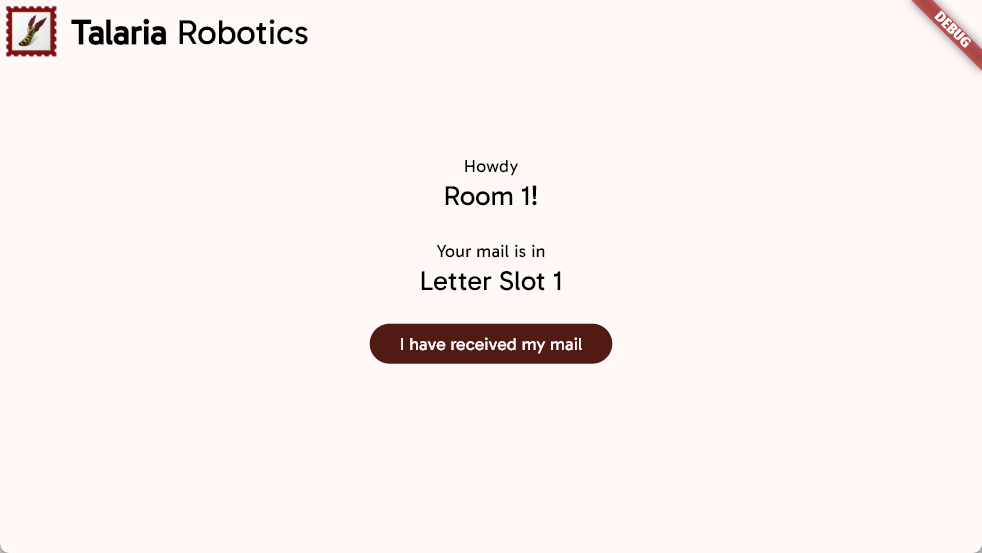
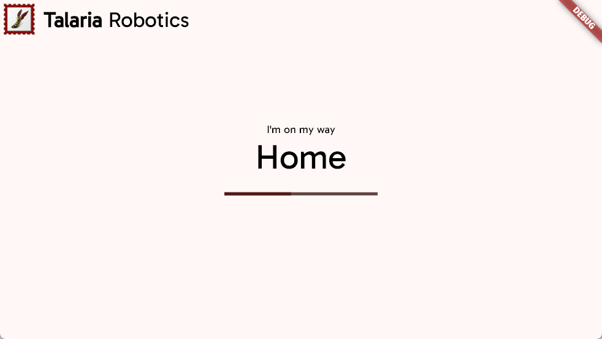

Talaria's autonomous mail delivery robot is built in two halves: the Navigator and Control Panel. The Navigator module is composed of a Raspberry Pi, the motor controller, and all navigation sensors such as LIDAR and motor encoders. Its primary purpose is to accept control commands from the Control Panel and navigate the SCUTTLE on the delivery route. The Control Panel module consists of another Raspberry Pi and a touchscreen, which serves as the interface for users to interact with the delivery system, primarily by planning and accepting deliveries.

**In short:**

* The [Navigator](#navigator) is the brains of the SCUTTLE platform including all navigation sensors
    * The Navigator [API](#api) is the surface used for high-level navigation commands
    * The Navigator Controller is the control loop that uses sensors and motors to move between waypoints
* The [Control Panel](#control-panel) is the primary interface between the user and the robot

***Figure 1:** High-level sequence of system events.*


***Figure 2:** Communication sequence for the delivery system.*


# Navigator

* Receives commands from [Control Panel](#control-panel)
* Stores floor map, rooms, and available bins
* Determines most efficient order of stops
* Plans ideal driving route
* Controls motors while avoiding obstacles using feedback from LIDAR and encoders

## API
The Navigator API acts as a layer between the [Control Panel](#control-panel) and the robot control loop. The interface itself is agnostic of any particular protocol, but Talaria's implementation uses HTTP via an Ethernet cable between the two Raspberry Pis (see [*Implementation*](#implementation)). In Dart, the interface looks like this:

```dart
abstract interface class NavigatorApi {
  Future<PossibleMailRouteInfo> getPossibleRouteInfo();

  Future<void> setRoute(RequestedMailRoute route);

  Stream<MailRouteEvent> listenToRoute();

  Future<void> deliveryCompleted();
}
```

### Route info
`getPossibleRouteInfo()` returns a structure that includes the available rooms and bins:

```json
{
  "id": "someGUID",
  "name": "Example Floor",
  "rooms": [
    {
      "id": "home",
      "name": "Mail Room"
    },
    {
      "id": "room1",
      "name": "Room 101"
    },
    {
      "id": "room2",
      "name": "Room 102"
    },
  ],
  "bins": [
    {
      "number": 1,
      "name": "Letter Slot 1"
    },
    {
      "number": 2,
      "name": "Letter Slot 2"
    },
    {
      "number": 5,
      "name": "Package Areas"
    },
  ]
}
```

### Route events
`listenToRoute()` streams a sequence of events from the Navigator of any of the following formats. Every event type has two properties: `$type` and `orderNumber`. The type property contains the name of the event type and is required so the client and deserialize the data into the proper structure. The `orderNumber` is an optional property that may be used by the client to process events correctly if they arrive out of order.

**In-transit:** The robot is on its way to the specified room.
```json
{
  "$type": "InTransit",
  "orderNumber": 1,
  "room": {
    "id": "room1",
    "name": "Room 1"
  }
}
```

**Arrived at stop:** The robot is currently waiting at the stop for the recipient to remove their mail from the specified bin.
```json
{
  "$type": "ArrivedAtStop",
  "orderNumber": 2,
  "room": {
    "id": "room1",
    "name": "Room 1"
  },
  "bin": {
    "number": 2,
    "name": "Letter Slot 1"
  }
}
```

**Return home:** The robot is currently waiting at the stop for the recipient to remove their mail from the specified bin.
```json
{
  "orderNumber": 3,
  "$type": "ReturnHome"
}
```


## Floor maps
Floor maps define the layout of a mail floor, which is used for path planning and some static obstacle avoidance. They are stored in a custom file format that encodes paths between points of delivery, referred to as stops.

Below is an example of a floor map:
```ini
[Meta]
Small Test A
77411ACA-B73D-4B02-AB38-4433573A5522

[Rooms]
mail: Mail Room
room1: Room 1
room2: Room 2
room3: Room 3

[Nodes]
mail: 2, 3
j1: 7, 5
room1: 4, 6
j2: 7, 6
room2: 7, 8
room3: 10.5, 3

[Paths]
mail > j1: H 7
j1 > room1: H 4
j1 > j2:
j2 > room2:
j2 > room3: H 10.5
mail > room3: c 4,-2 8.530415,-3e-7 8.530415,-3e-7
```

The format is composed of four sections:

* `Meta`: Floor plan name and unique ID
* `Rooms`: All available rooms on this floor, where the first room is assumed to be Home
* `Nodes`: Defines all rooms and junctions
* `Paths`: Defines connections between nodes

The `Rooms` section is used to specify which nodes are rooms by assigning a name to each room. This, along with the floor plan metadata, is the only data provided to the Control Panel (via `GET /possibleRoute`).

The `Nodes` and `Paths` sections together define a bi-directional graph that represents the navigatable paths between points of interest.

Nodes can either be rooms, as previously described, or as junctions that serve as intermediates between rooms. Junctions allow the path planning algorithm to skip over branches in the graph that connect only to rooms the robot does not need to stop at.

In the floor map file, a node is defined with an ID, followed by a colon, followed by the global coordinates of the node: `$nodeId: $x, $y`. These coordinates are intended to be in units of centimeters to reduce conversions, but in theory they can be specified in any length unit and converted at runtime.

Paths are defined by the starting node ID, a right angle bracket, the ending node ID, a colon, and an SVG path fragment: `$startNodeId > $endNodeId: $pathFragment`. The [SVG path format](https://developer.mozilla.org/en-US/docs/Web/SVG/Tutorial/Paths) was selected for its efficiency and existing tooling. A full SVG path is generated by prepending a move command with the starting node coordinates and appending a line command with the ending node coordinates: `M ${startNode.X} ${startNode.Y} $pathFragment L ${endNode.X} ${startNode.Y}`. This minimizes repetition of the node coordinates and allows simple, linear connections between nodes to be stored as empty strings. For example, `j1 > j2: ` results in a vertical line connection between `j1` and `j2` that is automatically corrected if the `j1` or `j2` nodes are moved.

***Figure 3:** Visualization of the graph defined in the example floor plan. Stops are shown in green and junctions in red.*


## Path planning
The path planning system takes a desired route, computes the most efficient paths, and breaks it down into simple local moves. The navigation process relies heavily on odometry to determine its global pose (2D position & heading).

1. [Control Panel](#control-panel) sets the desired route via the `POST /route` endpoint.
1. Navigator waits for a connection to its UDP socket, signaling that the Control Panel is ready to begin delivery.
1. The home node is prepended and appended to the desired stops to ensure the robot always starts from and ends at home.
1. Dijkstra's algorithm is used to determine the shortest path between each desired stop, using junctions as vias if necessary. This produces a list of nodes, where adjacent nodes in the list are directly connected to each other on the floorplan.
1. Starting with the first node, the path connecting it to the next node is discretized using a linear approximation with segments as small as one inch. Paths that are composed of true line segments (unlike Beziers) can be optimized into a few big segments, rather than many small segments.
1. An `InTransit` [event](#route-events) is sent to the Control Panel.
1. The desired heading angle for each segment is computed using the tangent vector at the starting point.
1. The robot subtracts its current position and heading from the desired position and heading to compute a correction.
1. Using the width of the wheelbase and the diameter of the wheel sprockets, the heading and forward corrections can be converted into target angular displacements for the left and right wheels. Assuming ideal circumstances:

    * Moving forward requires spinning both wheels in the same direction by the same amount. For Talaria's robot, the wheels spin 49.822° to move forward 1". Computing the target angular displacement is as simple as multiplying the distance in inches by 49.822.
    * Point turns require spinning the wheels in opposite directions by the same absolute amount. For this prototype, the wheels need to spin 10.0544° to rotate the robot by 1°. The target angular displacement can be computed by multiplying the desired heading angle by this factor.
    
1. The primary drive loop begins by reading the current angular position *θ* of the motor shafts. Note that this angle must take into account any gear ratios between the motor shaft and the driven wheels. For this prototype, the ratio is 2, so the measured angles must be divided by 2.
1. The current angle of each wheel is compared to the previous angle to compute *Δθ*. Without any conditioning, there will be a discontinuity every time the wheels cross 0°. If the wheel angles are checked frequently enough, it can be assumed that the wheels will never spin more than 180° between a single measurement. If *|Δθ|* is computed to be larger than 180, the following corrections are made:
    
    * If the current angle was greater than the previous angle, then `dTheta = currentAngle - (360.0 + previousAngle)`
    * Otherwise, `dTheta = currentAngle + (360.0 - previousAngle)`

1. *Δθ* is accumulated to determine the current angular displacement of each wheel for this move.
1. The remaining angular displacement is computed by subtracting the current displacement from the target displacement. Attempting to stop the robot when this remainder is exactly zero would fail, since the wheels spin more than a few degrees each iteration. Instead, the loop checks if the previous remainder had a different sign than the current remainder. The robot cannot teleport, so its movements are always continuous even if the readings are not. By the intermediate value theorem, if the remainder changes signs, the robot must have passed the target and should stop where it is.
1. The actual angular displacements are converted back to a forward distance and heading angle, which is used to keep track of the robot's actual position.
1. This process is repeated for every node. When the current node is marked as a stop, the robot sends an `ArrivedAtStop` event and waits for confirmation before proceeding.

## Implementation
For Talaria Robotics' mail delivery system, the API and Controller are implemented in Python across various modules. [`server.py`](https://github.com/Talaria-Robotics/navigator/blob/main/src/server.py) directly implements the [API](#api) as an HTTP server using [Sanic](https://sanic.dev/en/) for most requests, along with a UDP socket for streaming [route events](#route-events).

Name                   | Endpoint
---------------------- | ------------------------------
`getPossibleRouteInfo` | HTTP `GET /possibleRoute`
`setRoute`             | HTTP `POST /route`
`listenToRoute`        | Opens UDP socket on port 8076
`deliveryCompleted`    | Sends message via UDP socket

The Controller is implemented as a collection of modules that abstract away internal details, such as [PWM motor control](https://github.com/Talaria-Robotics/navigator/blob/main/src/motor.py) or [obstacle avoidance](https://github.com/Talaria-Robotics/navigator/blob/main/src/obstacle_avoidance.py).

Additional Python scripts exist for internal testing and visualization. Most notably, the [`lidar_nodered.py`](https://github.com/Talaria-Robotics/navigator/blob/main/src/lidar_nodered.py) script sends data to a Node-RED flow running on the Navigator Pi that visualizes the following data:

* LIDAR data as a point cloud representing nearby obstacles
* Encoder readings for the left and right motors as angles within a circle

# Control Panel
* Sends commands to [Navigator](#navigator)
* Asks delivery person to specify which bins contain mail for which rooms
* Shows a status message when bot is in transit
* Allows recipients to tell the bot when they have finished retrieving their items

In general, the Control Panel is designed to be very simple. The [Navigator API](#api) is designed in such a way that the Control Panel needs almost no domain logic or state management. Any information it needs can be immediately retrieved from the API. For example, the [in-transit event](#route-events) includes a complete room object, rather than providing only the room ID and leaving it up to the Control Panel to resolve the ID to a name. 

## UI flow
The Control Panel has four different screens that roughly correspond with the major events shown in *Figure 2*.

1. **Home:** Landing page for when the bot first starts up.
1. **Route planner:** Allows the sender to assign rooms to bins using data fetched via `getPossibleRouteInfo()`.
1. **Route confirmation:** Prompts the sender to confirm the bin-room assignments.
1. **Status:** Displays the current status of the delivery by streaming events from `listenToRoute()`.

**In-transit:** Informs passersby that the robot is on its way to a room.



**Arrived at stop:** Informs the recipient which bins contain mail for them. Waits for confirmation before calling `deliveryComplete()`.



**Return home:** Informs passersby that the robot has completed its route and is returning to its home position.

